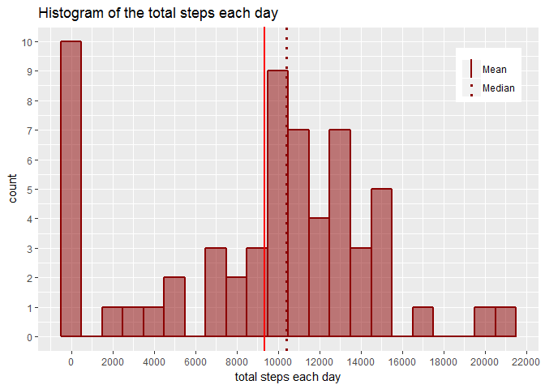
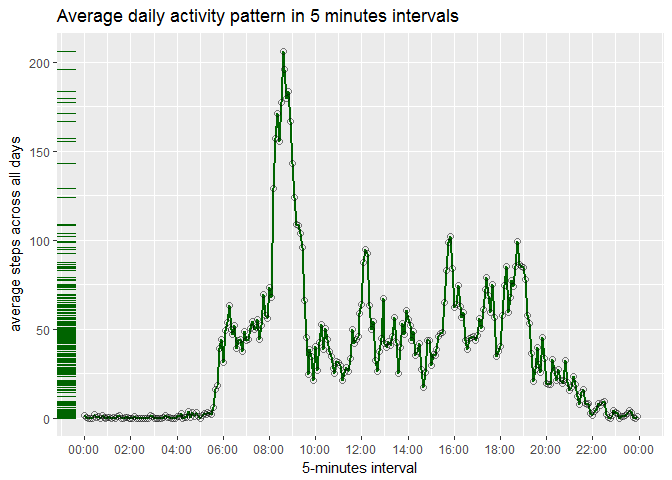
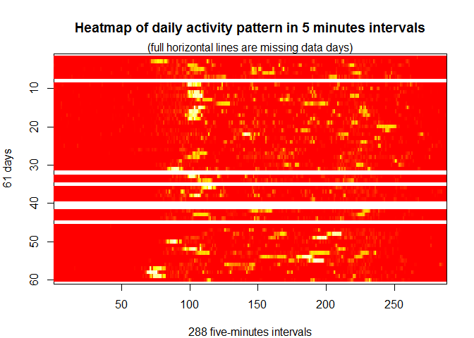
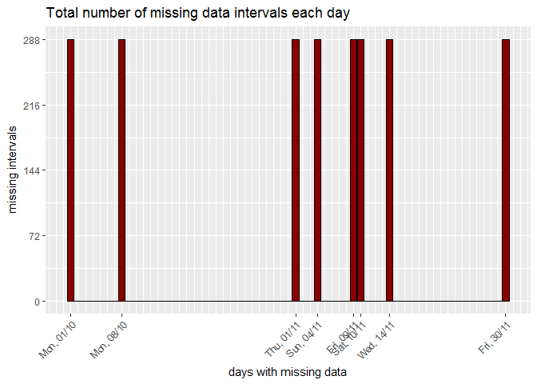
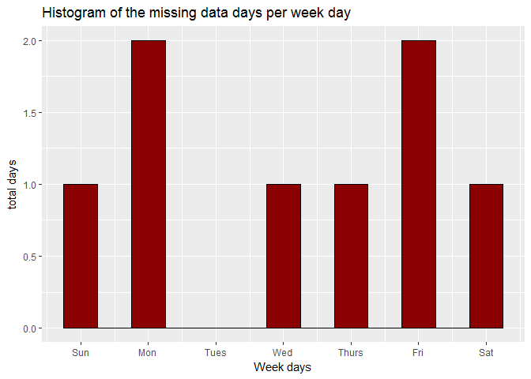
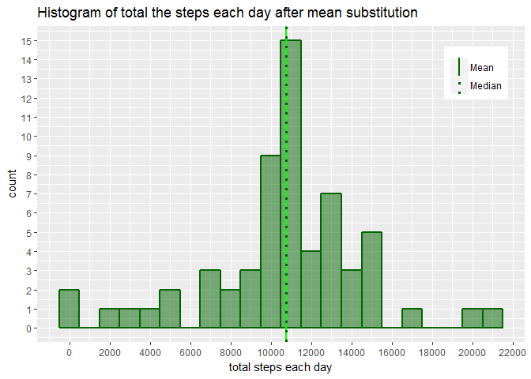
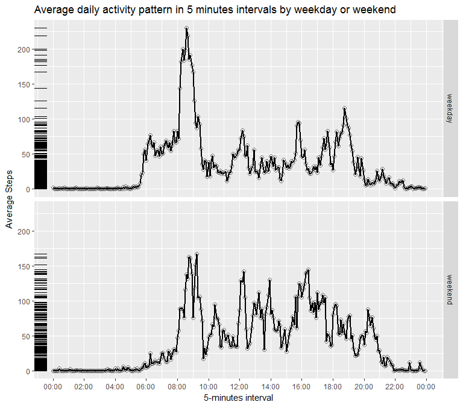

# Reproducible Research: Peer Assessment 1
Maurício Collaça  


**************
# Introduction

It is now possible to collect a large amount of data about personal movement using activity monitoring devices such as a Fitbit, Nike Fuelband, or Jawbone Up. These type of devices are part of the “quantified self” movement – a group of enthusiasts who take measurements about themselves regularly to improve their health, to find patterns in their behavior, or because they are tech geeks. But these data remain under-utilized both because the raw data are hard to obtain and there is a lack of statistical methods and software for processing and interpreting the data.

This assignment makes use of data from a personal activity monitoring device. This device collects data at 5 minute intervals through out the day. The data consists of two months of data from an anonymous individual collected during the months of October and November, 2012 and include the number of steps taken in 5 minute intervals each day.

The data for this assignment can be downloaded from the course web site:

Dataset: [Activity monitoring data][1] [52K]

[1]: https://d396qusza40orc.cloudfront.net/repdata%2Fdata%2Factivity.zip

The variables included in this dataset are:

`step`: Number of steps taking in a 5-minute interval (missing values are coded as NA)  
`date`: The date on which the measurement was taken in YYYY-MM-DD format  
`interval`: Identifier for the 5-minute interval in which measurement was taken  
The dataset is stored in a comma-separated-value (CSV) file and there are a total of 17,568 observations in this dataset.

************************************
# Loading and preprocessing the data

This research uses R version R version 3.4.2 (2017-09-28) and additional R packages:


```r
library(lubridate); library(dplyr); library(tidyr); library(ggplot2)
```

The package versions used are dplyr 0.7.4, tidyr 0.7.1, ggplot2 2.2.1 and lubridate 1.6.0.

The dataset zip file is automatically downloaded and uncompressed if not previously downloaded.


```r
url = "https://d396qusza40orc.cloudfront.net/repdata%2Fdata%2Factivity.zip"
destfile = "activity.zip"
if (!file.exists(destfile))
    download.file(url, destfile, mode = "wb", cacheOK = FALSE, quiet = TRUE)
if (!file.exists("activity.csv") & file.exists(destfile))
    unzip(destfile, setTimes = TRUE)
```

Import data columns with appropriate R classes and values: steps and interval as `integer` data type, date as `Date` data type and "NA" strings as `NA` values.


```r
activity <- read.csv("activity.csv", colClasses = c("integer", "Date", "integer"))
glimpse(activity)
```

```
## Observations: 17,568
## Variables: 3
## $ steps    <int> NA, NA, NA, NA, NA, NA, NA, NA, NA, NA, NA, NA, NA, N...
## $ date     <date> 2012-10-01, 2012-10-01, 2012-10-01, 2012-10-01, 2012...
## $ interval <int> 0, 5, 10, 15, 20, 25, 30, 35, 40, 45, 50, 55, 100, 10...
```

******************************************
# What is the mean total number of steps taken per day?

## Total number of steps each day


```r
daily <- activity %>% group_by(date) %>% summarise(total.steps = sum(steps, na.rm = TRUE)) %>% as.data.frame
glimpse(daily)
```

```
## Observations: 61
## Variables: 2
## $ date        <date> 2012-10-01, 2012-10-02, 2012-10-03, 2012-10-04, 2...
## $ total.steps <int> 0, 126, 11352, 12116, 13294, 15420, 11015, 0, 1281...
```

## Histogram of the total steps each day


```r
ggplot(daily, aes(x = total.steps)) +
    geom_histogram(binwidth = 1000, color = "dark red", size = 1, fill = "dark red", alpha = 0.5) +
    geom_vline(aes(xintercept=mean(daily$total.steps), linetype="Mean", size = "Mean"), color="red") +
    geom_vline(aes(xintercept=median(daily$total.steps), linetype="Median", size = "Median"), color = "dark red") +
    scale_linetype_manual(name = NULL, values = c("solid","dotted")) +
    scale_size_manual(name = NULL, values = c(1, 1.1)) +
    scale_x_continuous(breaks=seq.int(0, 22000, by = 2000)) +
    scale_y_continuous(breaks=0:(22000/2000-1)) +
    xlab("total steps each day") +
    ggtitle("Histogram of the total steps each day") +
    theme(legend.position = c(0.9, 0.85))
```

<!-- -->

## Mean and median of the total number of steps taken per day

**Mean.**


```r
mean(daily$total.steps)
```

```
## [1] 9354.23
```

**Median.**


```r
median(daily$total.steps)
```

```
## [1] 10395
```

********************************
# What is the average daily activity pattern?

## Time series plot

Time series plot of the 5-minute interval (x-axis) and the average number of steps taken, averaged across all days (y-axis)

**Data transformation.**

The Identifier for the 5-minute interval is an integer value coded as **hhmm**, for instance, the interval number 100 means the 13th 5-minute interval at precisely at 1:00am.

In order to improve the format of the x scale of the time series plot, it's calculated the actual number of seconds from the interval identifier.


```r
interval2seconds <- function(interval) {
    trunc(interval/100) * 60 * 60 + (interval %% 100)*60
}
five <- activity %>%
    group_by(interval) %>%
    summarise(mean.steps = mean(steps, na.rm = TRUE)) %>%
    mutate(seconds = interval2seconds(interval)) %>%
    as.data.frame
glimpse(five)
```

```
## Observations: 288
## Variables: 3
## $ interval   <int> 0, 5, 10, 15, 20, 25, 30, 35, 40, 45, 50, 55, 100, ...
## $ mean.steps <dbl> 1.7169811, 0.3396226, 0.1320755, 0.1509434, 0.07547...
## $ seconds    <dbl> 0, 300, 600, 900, 1200, 1500, 1800, 2100, 2400, 270...
```

**Plotting.**


```r
breaks <- seq(0, 86400, length.out = 13)
labels <- strftime(as.POSIXct(breaks, tz="GMT", origin="1970-01-01"), format = "%H:%M", tz="GMT")
ggplot(five, aes(seconds, mean.steps)) +
    scale_x_continuous(breaks = breaks, labels = labels) +
    geom_line(size=1, aes(colour="Average steps")) +
    geom_point(color = "black", size=2, pch = 21, alpha=0.5) +
    geom_rug(sides="l", color = "dark green") +
    scale_colour_manual(name = 'Series', values=c("dark green", "dark red", "blue")) +
    ggtitle("Average daily activity pattern in 5 minutes intervals") +
    ylab("average steps across all days") + xlab("5-minutes interval") +
    theme(legend.position = "none")
```

<!-- -->

## Maximum number of steps interval

Which 5-minute interval, on average across all the days in the dataset, contains the maximum number of steps?


```r
(maxInterval <- with(five,interval[which.max(mean.steps)]))
```

```
## [1] 835
```

*************************
# Imputing missing values

Note that there are a number of days/intervals where there is missing values (coded as NA). The presence of missing days may introduce bias into some calculations or summaries of the data.

## Total number of missing values in the dataset


```r
(missingValuesTotal <- sum(is.na(activity$steps)))
```

```
## [1] 2304
```

The proportion of the missing values is considerably high and deserves an exploration of the missing data pattern.


```r
(missingValueRatio <- mean(is.na(activity$steps)))
```

```
## [1] 0.1311475
```

## Strategy for filling in all of the missing values in the dataset

The strategy for filling in all of the missing values in the dataset does not need to be sophisticated. For example, one can use the mean/median for that day, or the mean for that 5-minute interval, etc.

According to Peng (2016), in the book [Exploratory Data Analysis](https://leanpub.com/exdata):

_"Determine the reason for the missing data; what is the process that lead to the data
being missing? Is the proportion of missing values so high as to invalidate any sort of analysis? Is there information in the dataset that would allow you to predict/infer the values of the missing data?"_

A non-exhaustive hypothesis list:

* The device may fail to collect and store raw data or run out of battery.  
* The test subject forget either to charge or switch on the device during the experiment period.  
* The process to collect data from the device and build the raw dataset may fail.
* The data was removed from the dataset for educational and testing purposes.

After the upcoming imputation experiment one can compare the impact of the change over the missing  data.

The missing data represents 13.11% of the dataset observations which, although is considered high, possibly would not invalidate analysis based on this dataset.

### Missing data patterns

The following plots help to understand the missing data patterns.

#### Heatmap of daily activity pattern in 5 minutes intervals

Transform the long form (17568x3) dataset in a wide form matrix.


```r
intervalMatrix <- activity %>% spread(key = interval, value = steps) %>% mutate(date = NULL) %>% as.matrix
```

This new data format (61x288 ) features 61 days as observations and 288 five-minutes intervals as variables.

Previewing 10 rows by 10 columns.


```r
intervalMatrix[1:10,1:10]
```

```
##        0  5 10 15 20 25 30 35 40 45
##  [1,] NA NA NA NA NA NA NA NA NA NA
##  [2,]  0  0  0  0  0  0  0  0  0  0
##  [3,]  0  0  0  0  0  0  0  0  0  0
##  [4,] 47  0  0  0  0  0  0  0  0  0
##  [5,]  0  0  0  0  0  0  0  0  0  0
##  [6,]  0  0  0  0  0  0  0  0  0  0
##  [7,]  0  0  0  0  0  0  0  0  0  0
##  [8,] NA NA NA NA NA NA NA NA NA NA
##  [9,]  0  0  0  0  0 13 28  0  0  0
## [10,] 34 18  7  0  0  0  0  0  0  0
```

Plotting a matrix heatmap image where some missing values can be visually identified.


```r
colors<-length(unique(as.vector(intervalMatrix)))
par(mar=c(4, 4, 4, 2))
image(1:ncol(intervalMatrix),
      1:nrow(intervalMatrix), ylim=c(nrow(intervalMatrix),1),
      t(intervalMatrix),
      xlab = paste0(ncol(intervalMatrix)," five-minutes intervals"),
      ylab = paste0(nrow(intervalMatrix)," days"),
      col = heat.colors(colors),
      main = "Heatmap of daily activity pattern in 5 minutes intervals")
mtext("(full horizontal lines are missing data days)")
```

<!-- -->

One can roughly see in the white horizontal lines that there is missing data at full days.  It will be checked more precisely whether missing data also occurs during parts of the days.

#### Total number of missing data intervals each day

**Data transformation.**


```r
missingDaily <- activity %>% group_by(date) %>% summarise(missing.intervals = sum(is.na(steps))) %>% as.data.frame
glimpse(missingDaily)
```

```
## Observations: 61
## Variables: 2
## $ date              <date> 2012-10-01, 2012-10-02, 2012-10-03, 2012-10...
## $ missing.intervals <int> 288, 0, 0, 0, 0, 0, 0, 288, 0, 0, 0, 0, 0, 0...
```

Plotting a bar chart with the total number of missing values per day.


```r
breaks <- as.Date(which(missingDaily$missing.intervals!=0), origin=missingDaily$date[1]-1)
dayLabels <- strftime(breaks, format = "%a, %d/%m", tz="GMT")
ggplot(missingDaily, aes(date, missing.intervals)) +
    geom_col(fill = "dark red", color = "black") +
    ggtitle("Total number of missing data intervals each day") +
    scale_y_continuous(breaks = seq.int(0, 288, length.out = 5)) +
    ylab("missing intervals") + xlab("days with missing data") +
    scale_x_date(breaks = breaks, labels = dayLabels, date_minor_breaks = "1 days", minor_breaks = NULL) +
    theme(axis.text.x = element_text(angle = 45, vjust = 1, hjust=1))
```

<!-- -->

Whatever are the reasons of the missing data days, there are some noticeable facts:

1. They happen only on eight full days
2. They happen on the first and last days of the experiment.
3. They happen on the first two Mondays.
4. They happen on two adjacent days only once.

#### Histogram of the missing data days per week day

The following histogram shows the frequency of missing data days per week day:


```r
breaks <- wday(breaks)
wdayLabels <- wday(1:7, label=TRUE)
ggplot(mapping = aes(breaks)) +
    geom_histogram(binwidth = 0.5, fill = "dark red", color = "black") +
    scale_x_continuous(breaks = 1:7, labels = wdayLabels) +
    xlab("Week days") + ylab("total days") +
    ggtitle("Histogram of the missing data days per week day")
```

<!-- -->

Based on this distribution it's being assumed that missing data days occur at random.

As there are only full missing data days, there is no point to perform a deeper analysis to identify missing data patterns within days.

### Imputation technique

The imputation technique consists of replacing all 2304 missing interval values with their respective *Average daily activity pattern in 5-minutes intervals*.


## Imputed dataset

Create a new dataset that is equal to the original dataset but with the missing data filled in.

Replacing the missing values with the *Average daily activity pattern in 5-minutes intervals* for that interval.


```r
activityImputed <- activity %>% left_join(five) %>% mutate(steps = coalesce(steps, as.integer(round(mean.steps))), mean.steps=NULL, seconds=NULL)
```

```
## Joining, by = "interval"
```

```r
glimpse(activityImputed)
```

```
## Observations: 17,568
## Variables: 3
## $ steps    <int> 2, 0, 0, 0, 0, 2, 1, 1, 0, 1, 0, 0, 0, 1, 0, 0, 0, 1,...
## $ date     <date> 2012-10-01, 2012-10-01, 2012-10-01, 2012-10-01, 2012...
## $ interval <int> 0, 5, 10, 15, 20, 25, 30, 35, 40, 45, 50, 55, 100, 10...
```

## Make a histogram of the new total number of steps taken each day after mean substitution

**Total number of steps taken each day after mean substitution**


```r
dailyImputed <- activityImputed %>% group_by(date) %>% summarise(total.steps = sum(steps, na.rm = TRUE))
glimpse(dailyImputed)
```

```
## Observations: 61
## Variables: 2
## $ date        <date> 2012-10-01, 2012-10-02, 2012-10-03, 2012-10-04, 2...
## $ total.steps <int> 10762, 126, 11352, 12116, 13294, 15420, 11015, 107...
```

**Histogram of the total steps each day after mean substituion.**


```r
ggplot(dailyImputed, aes(x = total.steps)) +
    geom_histogram(binwidth = 1000, color = "dark green", size = 1, fill = "dark green", alpha=0.5) +
    geom_vline(aes(xintercept=mean(dailyImputed$total.steps),
                   linetype = "Mean", size = "Mean"), color = "dark green") +
    geom_vline(aes(xintercept=median(dailyImputed$total.steps),
                   linetype = "Median", size = "Median"), color = "dark green") +
    scale_linetype_manual(name = NULL, values = c("solid", "dotted")) +
    scale_size_manual(name = NULL, values = c(1, 1.1)) +
    scale_x_continuous(breaks=seq.int(0, 22000, by = 2000)) +
    scale_y_continuous(breaks=0:(22000/2000+4)) +
    xlab("total steps each day") +
    ggtitle("Histogram of total the steps each day after mean substitution") +
    theme(legend.position = c(0.9, 0.85))
```

<!-- -->

**Do these values differ from the estimates from the first part of the assignment?**

One can see the the mean has become closer to the median.

**What is the impact of imputing missing data on the estimates of the total daily number of steps?**

The original mean of the total number of steps taken per day has changed from 9354 to:


```r
round(mean(dailyImputed$total.steps))
```

```
## [1] 10766
```

The original median of the total number of steps taken per day has changed from 10395 to:


```r
round(median(dailyImputed$total.steps))
```

```
## [1] 10762
```


***************************************************************************
# Are there differences in activity patterns between weekdays and weekends?

## Weekdays and weekend factors

Create a new factor variable in the dataset with two levels – “weekday” and “weekend” indicating whether a given date is a weekday or weekend day.


```r
activityImputed <- activityImputed %>%
    mutate(dayType=as.factor(ifelse(wday(date)%%6==1,"weekend","weekday")))
glimpse(activityImputed)
```

```
## Observations: 17,568
## Variables: 4
## $ steps    <int> 2, 0, 0, 0, 0, 2, 1, 1, 0, 1, 0, 0, 0, 1, 0, 0, 0, 1,...
## $ date     <date> 2012-10-01, 2012-10-01, 2012-10-01, 2012-10-01, 2012...
## $ interval <int> 0, 5, 10, 15, 20, 25, 30, 35, 40, 45, 50, 55, 100, 10...
## $ dayType  <fctr> weekday, weekday, weekday, weekday, weekday, weekday...
```

## Five-minutes interval average steps across all weekdays or weekends

Make a panel plot containing a time series plot (i.e. type = "l") of the 5-minute interval (x-axis) and the average number of steps taken, averaged across all weekday days or weekend days (y-axis).

**Data transformation.**


```r
fiveImputed <- activityImputed %>% group_by(dayType, interval) %>% summarise(mean.steps = mean(steps, na.rm = TRUE)) %>% mutate(seconds = interval2seconds(interval)) %>% as.data.frame
glimpse(fiveImputed)
```

```
## Observations: 576
## Variables: 4
## $ dayType    <fctr> weekday, weekday, weekday, weekday, weekday, weekd...
## $ interval   <int> 0, 5, 10, 15, 20, 25, 30, 35, 40, 45, 50, 55, 100, ...
## $ mean.steps <dbl> 2.28888889, 0.40000000, 0.15555556, 0.17777778, 0.0...
## $ seconds    <dbl> 0, 300, 600, 900, 1200, 1500, 1800, 2100, 2400, 270...
```

**Plotting.**


```r
breaks <- seq(0, 86400, length.out = 13)
labels <- strftime(as.POSIXct(breaks, tz="GMT", origin="1970-01-01"), format = "%H:%M", tz="GMT")
ggplot(fiveImputed, aes(seconds, mean.steps), colour = "black") +
    facet_grid(dayType ~.) +
    scale_x_continuous(breaks = breaks, labels = labels) +
    geom_line(size=1) +
    geom_point(color = "black", size=2, pch = 21, alpha=0.5) +
    geom_rug(sides="l") +
    ggtitle("Average daily activity pattern in 5 minutes intervals by weekday or weekend") +
    ylab("Average Steps") + xlab("5-minutes interval") +
    theme(legend.position = "none")
```

<!-- -->

