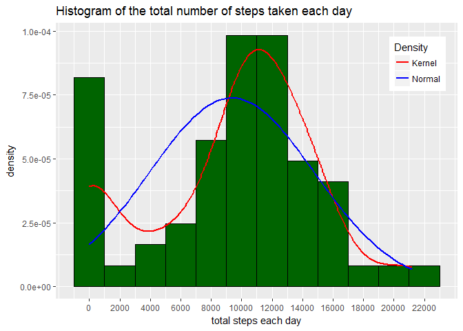
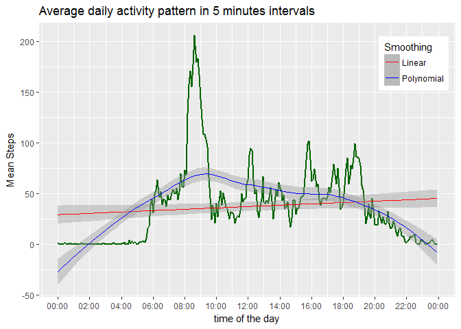

# Reproducible Research: Peer Assessment 1


**************
# Introduction

It is now possible to collect a large amount of data about personal movement using activity monitoring devices such as a Fitbit, Nike Fuelband, or Jawbone Up. These type of devices are part of the “quantified self” movement – a group of enthusiasts who take measurements about themselves regularly to improve their health, to find patterns in their behavior, or because they are tech geeks. But these data remain under-utilized both because the raw data are hard to obtain and there is a lack of statistical methods and software for processing and interpreting the data.

This assignment makes use of data from a personal activity monitoring device. This device collects data at 5 minute intervals through out the day. The data consists of two months of data from an anonymous individual collected during the months of October and November, 2012 and include the number of steps taken in 5 minute intervals each day.

The data for this assignment can be downloaded from the course web site:

Dataset: [Activity monitoring data][1] [52K]

[1]: https://d396qusza40orc.cloudfront.net/repdata%2Fdata%2Factivity.zip

The variables included in this dataset are:

`step`: Number of steps taking in a 5-minute interval (missing values are coded as NA)  
`date`: The date on which the measurement was taken in YYYY-MM-DD format  
`interval`: Identifier for the 5-minute interval in which measurement was taken  
The dataset is stored in a comma-separated-value (CSV) file and there are a total of 17,568 observations in this dataset.

************************************
# Loading and preprocessing the data

This research requires additional R packages.


```r
library(dplyr)
library(tidyr)
library(ggplot2)
library(lubridate)
library(impute)
```

The installed packages versions used in this research are dplyr 0.5.0,tidyr 0.6.1, ggplot2 2.2.1, lubridate 1.6.0 and impute 1.48.0.

The dataset zip file is automatically downloaded and uncompressed in case it's not already available locally.


```r
url = "https://d396qusza40orc.cloudfront.net/repdata%2Fdata%2Factivity.zip"
destfile = "activity.zip"
if (!file.exists(destfile)) {
    download.file(url, destfile, mode = "wb", cacheOK = FALSE, quiet = TRUE)
}
if (!file.exists("activity.csv") & file.exists(destfile)) {
    unzip(destfile, setTimes = TRUE)
}
```

Import data columns with appropriate R classes and values:

- `steps` and `interval` as `integer` data type.
- `date` as `Date` data type.
- "NA" strings as `NA` values.


```r
if (!exists("activity"))
    activity <- read.csv("activity.csv", colClasses = c("integer", "Date", "integer"), na.strings = "NA")
glimpse(activity)
```

```
## Observations: 17,568
## Variables: 3
## $ steps    <int> NA, NA, NA, NA, NA, NA, NA, NA, NA, NA, NA, NA, NA, N...
## $ date     <date> 2012-10-01, 2012-10-01, 2012-10-01, 2012-10-01, 2012...
## $ interval <int> 0, 5, 10, 15, 20, 25, 30, 35, 40, 45, 50, 55, 100, 10...
```

******************************************
# Mean total number of steps taken per day

## Calculate the total number of steps taken per day

For this part of the assignment, you can ignore the missing values in the dataset.


```r
if (!exists("daily")) {
    daily <- activity %>%
    group_by(date) %>%
    summarise(total.steps = sum(steps, na.rm = TRUE)) %>%
    as.data.frame
}
glimpse(daily)
```

```
## Observations: 61
## Variables: 2
## $ date        <date> 2012-10-01, 2012-10-02, 2012-10-03, 2012-10-04, 2...
## $ total.steps <int> 0, 126, 11352, 12116, 13294, 15420, 11015, 0, 1281...
```

## Histogram of the total number of steps taken each day


```r
ggplot(daily, aes(x = total.steps)) +

    geom_histogram(aes(y = ..density..), binwidth = 2000, fill = "dark green", color = "black") +
    
    geom_line(aes(y = ..density.., colour = 'Kernel'), stat = "density", lwd = 1) +

    stat_function(fun = dnorm,
                  args = list(mean = mean(daily$total.steps), sd = sd(daily$total.steps)),
                  aes(colour = "Normal"), lwd = 1) +

    scale_colour_manual(name = 'Density', values = c('red', 'blue')) +
    xlab("total steps each day") +# ylab("") +
    ggtitle("Histogram of the total number of steps taken each day") +
    theme(legend.position = c(0.9, 0.85)) +
    #scale_y_continuous(labels = scales:percent) +
    scale_x_continuous(breaks=seq.int(0, 22000, by = 2000))
```

<!-- -->

## Mean and median of the total number of steps taken per day

Mean of the total number of steps taken per day

```r
mean(daily$total.steps, na.rm = TRUE)
```

```
## [1] 9354.23
```
Median of the total number of steps taken per day

```r
median(daily$total.steps, na.rm = TRUE)
```

```
## [1] 10395
```

********************************
# Average daily activity pattern

## Time series plot

Make a time series plot (i.e. type = "l") of the 5-minute interval (x-axis) and the average number of steps taken, averaged across all days (y-axis)


```r
fiveminutes <- activity %>% group_by(interval) %>% summarise(mean.steps = mean(steps, na.rm = TRUE)) %>% mutate(seconds = trunc(interval/100) * 60 * 60 + (interval %% 100)*60) %>% as.data.frame
glimpse(fiveminutes)
```

```
## Observations: 288
## Variables: 3
## $ interval   <int> 0, 5, 10, 15, 20, 25, 30, 35, 40, 45, 50, 55, 100, ...
## $ mean.steps <dbl> 1.7169811, 0.3396226, 0.1320755, 0.1509434, 0.07547...
## $ seconds    <dbl> 0, 300, 600, 900, 1200, 1500, 1800, 2100, 2400, 270...
```


```r
breaks <- seq(0, 86400, length.out = 13)
labels <- strftime(as.POSIXct(breaks, tz="GMT", origin="1970-01-01"), format = "%H:%M", tz="GMT")
ggplot(fiveminutes, aes(seconds, mean.steps)) + geom_line(color = "dark green", size=1) +
    geom_smooth(method="lm", aes(colour="Linear"), lwd = 0.5) +
    geom_smooth(method="loess", aes(colour = 'Polynomial'), lwd = 0.5) +
    scale_colour_manual(name = 'Smoothing', values=c("red","blue")) +
    ggtitle("Average daily activity pattern in 5 minutes intervals") +
    ylab("Mean Steps") + xlab("time of the day") +
    scale_x_time(breaks = breaks, labels = labels) +
    theme(legend.position = c(0.9, 0.85))
```

<!-- -->

## Maximum number of steps

Which 5-minute interval, on average across all the days in the dataset, contains the maximum number of steps?


```r
(maxInterval <- with(fiveminutes,interval[which.max(mean.steps)]))
```

```
## [1] 835
```

*************************
# Imputing missing values

Note that there are a number of days/intervals where there is missing values (coded as NA). The presence of missing days may introduce bias into some calculations or summaries of the data.

## Total number of missing values in the dataset


```r
(missingValuesTotal <- sum(is.na(activity$steps)))
```

```
## [1] 2304
```
Proportion of the missing values

```r
(missingValueRatio <- mean(is.na(activity$steps)))
```

```
## [1] 0.1311475
```
This proportion of the dataset observations is considered high and deserve an exploration of the missing data pattern.

## Strategy for filling in all of the missing values in the dataset

The strategy for filling in all of the missing values in the dataset does not need to be sophisticated. For example, one can use the mean/median for that day, or the mean for that 5-minute interval, etc.

According to Peng (2016), in the book *Exploratory Data Analysis*:

_"Determine the reason for the missing data; what is the process that lead to the data
being missing? Is the proportion of missing values so high as to invalidate any sort of analysis? Is there information in the dataset that would allow you to predict/infer the values of the missing data?"_

As per this research scope didn't cover published information about the reasons missing data of this dataset, one can presume some hyphotesis:

* The device may fail to collect and store raw data or run out of battery.  
* The test subject forget either to charge or switch on the device during the experiment period.  
* The process to collect data from the device and build the raw dataset may fail.

After next exploratory data analysis and imputation experiments one can compare the impact of the change against the absence of the data.

The missing data represents 13.11% of the dataset observations which, although is considered high, possibly would not invalidate analysis based on this dataset.

### Missing data patterns

**Heatmap of daily activity pattern in 5 minutes intervals**

Transform the long-form (17568 by 3) dataset in a wider matrix.

```r
intervalMatrix <- activity %>%
    spread(key = interval, value = steps) %>%
    mutate(date = NULL) %>%
    as.matrix
```
This new layout features 61 days as observations and 288 five-minutes intervals as variables.

Previewing 10 rows by 10 columns.


```r
intervalMatrix[1:10,1:10]
```

```
##        0  5 10 15 20 25 30 35 40 45
##  [1,] NA NA NA NA NA NA NA NA NA NA
##  [2,]  0  0  0  0  0  0  0  0  0  0
##  [3,]  0  0  0  0  0  0  0  0  0  0
##  [4,] 47  0  0  0  0  0  0  0  0  0
##  [5,]  0  0  0  0  0  0  0  0  0  0
##  [6,]  0  0  0  0  0  0  0  0  0  0
##  [7,]  0  0  0  0  0  0  0  0  0  0
##  [8,] NA NA NA NA NA NA NA NA NA NA
##  [9,]  0  0  0  0  0 13 28  0  0  0
## [10,] 34 18  7  0  0  0  0  0  0  0
```


```r
colors<-length(unique(as.vector(intervalMatrix)))
par(mar=c(4, 4, 4, 2))
image(1:ncol(intervalMatrix),
      1:nrow(intervalMatrix), ylim=c(nrow(intervalMatrix),1),
      t(intervalMatrix),
      xlab = paste0(ncol(intervalMatrix)," five-minutes intervals"),
      ylab = paste0(nrow(intervalMatrix)," days"),
      col = heat.colors(colors),
      main = "Heatmap of daily activity pattern in 5 minutes intervals")
mtext("(full horizontal lines are missing data days)")
```

<!-- -->

One can see there is missing data at full days.  It will be checked whether missing data also occurs during parts of the days.


```r
missingDaily <- activity %>% group_by(date) %>% summarise(missing.intervals = sum(is.na(steps))) %>% as.data.frame
glimpse(missingDaily)
```

```
## Observations: 61
## Variables: 2
## $ date              <date> 2012-10-01, 2012-10-02, 2012-10-03, 2012-10...
## $ missing.intervals <int> 288, 0, 0, 0, 0, 0, 0, 288, 0, 0, 0, 0, 0, 0...
```


```r
breaks <- as.Date(which(missingDaily$missing.intervals!=0), origin=missingDaily$date[1]-1)
labels <- strftime(breaks, format = "%a, %d/%m", tz="GMT")
ggplot(missingDaily, aes(date, missing.intervals)) + geom_col(fill = "dark red", color = "black") +
    ggtitle("Total number of missing data intervals each day") +
    scale_y_continuous(breaks = seq.int(0, 288, length.out = 5)) +
    ylab("missing intervals") + xlab("days with missing data") +
    scale_x_date(breaks = breaks, labels = labels, date_minor_breaks = "1 days", minor_breaks = NULL) +
    theme(axis.text.x = element_text(angle = 45, vjust = 1, hjust=1))
```

<!-- -->

Maxixum missing intervals in a day:

```r
(maxMissingIntervals <- max(missingDaily$missing.intervals))
```

```
## [1] 288
```
Days without any data:

```r
(missingDays <- sum(missingDaily$missing.intervals==nrow(fiveminutes)))
```

```
## [1] 8
```
Days with full interval data:

```r
(fullDays <- sum(missingDaily$missing.intervals==0))
```

```
## [1] 53
```
Days with partial interval data:

```r
(partialDays <- sum(missingDaily$missing.intervals > 0 & missingDaily$missing.intervals < nrow(fiveminutes)))
```

```
## [1] 0
```

Whatever are the reasons of the missing data days, there are some noticible facts:

1. They happen only on full days
2. They happen on the first (Mon, 01/10) and last (Fri, 30/11) days of the experiment.
3. They happen on the first two Mondays: Mon, 01/10 and Mon, 08/10.
4. They happen on two adjacent days only once: Fri, 09/11 and Sat, 10/11.

The following histogram shows the frequency of missing data days per week day:


```r
breaks <- wday(breaks)
labels <- wday(1:7, label=TRUE)
ggplot(mapping = aes(breaks)) + geom_histogram(binwidth = 0.5, fill = "dark red", color = "black") +
    scale_x_continuous(breaks = 1:7, labels = labels) +
    xlab("Week days") +
    ggtitle("Histogram of the missing data days per week day")
```

<!-- -->

Based on this distribution it's being assumed that missing data days occur at random.

As there are only full missing data days, there is no point to perform a deeper analysis to identify missing data patterns within days.

### Imputation algorithms

This research will experiment and compare two techniques:

**Single imputation using mean substitution**

_"Involves replacing any missing value with the mean of that variable for all other cases, which has the benefit of not changing the sample mean for that variable. However, mean imputation attenuates any correlations involving the variable(s) that are imputed. This is because, in cases with imputation, there is guaranteed to be no relationship between the imputed variable and any other measured variables. Thus, mean imputation has some attractive properties for univariate analysis but becomes problematic for multivariate analysis."_ [Wikipedia][2], 2017.

[2]: https://en.wikipedia.org/wiki/Imputation_(statistics)#Imputation_techniques

One can assume that the mean substitution is an adequate technique because this research is 
about univariate data, in other words, a single predictor variable.  From the different means previously calculated, the *Average daily activity pattern in 5 minutes intervals* is the candidate  to have the least bias, and it seems to be the best choice for imputation.

**Nearest neighbor averaging using R package `{impute}` from the [Bioconductor project][3]**

[3]: http://www.bioconductor.org/packages/release/bioc/html/impute.html

_"For each gene with missing values, we find the $k$ nearest neighbors using a Euclidean metric, confined to the columns for which that gene is NOT missing. Each candidate neighbor might be missing some of the coordinates used to calculate the distance. In this case we average the distance from the non-missing coordinates. Having found the $k$ nearest neighbors for a gene, we impute the missing elements by averaging those (non-missing) elements of its neighbors. This can fail if ALL the neighbors are missing in a particular element. In this case we use the overall column mean for that block of genes."_ [Bioconductor, 2016.][3]

_"Since nearest neighbor imputation costs $O(p*log(p))$ operations per gene, where $p$ is the number of rows, the computational time can be excessive for large $p$ and a large number of missing rows. Our strategy is to break blocks with more than $maxp$ genes into two smaller blocks using two-mean clustering. This is done recursively till all blocks have less than $maxp$ genes. For each block, $k$-nearest neighbor imputation is done separately. We have set the default value of $maxp$ to $1500$. Depending on the speed of the machine, and number of samples, this number might be increased. Making it too small is counter-productive, because the number of two-mean clustering algorithms will increase."_ [Bioconductor, 2016.][3]

At this point of the research, the results of the K-NN algorithm is unknown but they will be compared with the single imputation using mean substitution later.

## Imputed dataset

Create a new dataset that is equal to the original dataset but with the missing data filled in.

### Using single imputation, mean substitution

For each missing 5-minute interval, substitute the mean for that 5-minute interval taken across all days.

```r
imputedMean <- activity %>%
    mutate(steps = coalesce(steps, as.integer(round(fiveminutes$mean.steps[fiveminutes$interval == interval]))))
glimpse(imputedMean)
```

```
## Observations: 17,568
## Variables: 3
## $ steps    <int> 2, 0, 0, 0, 0, 2, 1, 1, 0, 1, 0, 0, 0, 1, 0, 0, 0, 1,...
## $ date     <date> 2012-10-01, 2012-10-01, 2012-10-01, 2012-10-01, 2012...
## $ interval <int> 0, 5, 10, 15, 20, 25, 30, 35, 40, 45, 50, 55, 100, 10...
```

### Using *k*-nearest neighbor averaging

The default $k$ is 10 neighbors.

TODO: REVISE
As there is missing data only on 8 full days, the maximum *k*-neighbors possible are 53.


```r
(maxNeighbors <- nrow(missingDaily) - missingDays)
```

```
## [1] 53
```
Calculate `rowmax`, the maximum percent missing data allowed in any row (default 50%). For any rows with more than rowmax%, missing are imputed using the overall mean per sample.

TODO: REVISE
In order to avoid the bias of using overall mean per sample, `rowmax` should never be reached.  As there are full rows (days) with missing values, `rowmax` should be 288/288, 1.  A general formula to optimize `rowmax` is dividing the maximum number of missing values in a row by the number of columns:


```r
rowmax <- maxMissingIntervals / nrow(fiveminutes) ; sprintf("%1.2f%%", 100*rowmax)
```

```
## [1] "100.00%"
```
Calculate `colmax`, the maximum percent missing data allowed in any column (default 80%). If any column has more than colmax% missing data, the program halts and reports an error.

TODO: REVISE
As there is missing data only in 8 full days (rows) of 61 days,  the `colmax` should be at minimum the 8/61 ratio, 0.1311475.  A general formula to ensure a minimum `colmax` is dividing the maximum number of missing values in a column by the number of rows:


```r
#colmax <- activity %>% group_by(interval) %>% summarise(missing.intervals = sum(is.na(steps))) %>% with(max(missing.intervals) / row(intervalMatrix)) ; sprintf("%1.2f%%", 100*colmax)
colmax <- 8/61 ; sprintf("%1.2f%%", 100*colmax)
```

```
## [1] "13.11%"
```
Impute missing expression data using the *k*-nearest neighbor averaging.

TODO: Whether to optimize default $k$:

http://dataaspirant.com/2017/01/02/k-nearest-neighbor-classifier-implementation-r-scratch/
https://www.analyticsvidhya.com/blog/2015/08/learning-concept-knn-algorithms-programming/
https://www3.nd.edu/~steve/computing_with_data/17_Refining_kNN/refining_knn.html
http://en.proft.me/2017/01/22/classification-using-k-nearest-neighbors-r/
https://www.researchgate.net/post/How_can_we_find_the_optimum_K_in_K-Nearest_Neighbor
https://pdfs.semanticscholar.org/fe5a/6a37a7bd474ed4c561fd43e09a8fefae314c.pdf
http://www.cs.haifa.ac.il/~rita/ml_course/lectures/KNN.pdf

TODO: run impute.knn with multiple Ks


```r
imputedKNN <- 
    impute.knn(intervalMatrix, k = maxNeighbors, rowmax = rowmax, colmax=colmax)$data %>%
    as.data.frame
print(as.matrix(imputedKNN)[1:5,1:6], quote=FALSE)
```

```
##             0         5        10        15         20       25
## [1,]  1.93617 0.3829787 0.1489362 0.1702128 0.08510638 2.361702
## [2,]  0.00000 0.0000000 0.0000000 0.0000000 0.00000000 0.000000
## [3,]  0.00000 0.0000000 0.0000000 0.0000000 0.00000000 0.000000
## [4,] 47.00000 0.0000000 0.0000000 0.0000000 0.00000000 0.000000
## [5,]  0.00000 0.0000000 0.0000000 0.0000000 0.00000000 0.000000
```

Restore the date column, gather intervals, round steps, coerce to integer and arrange data

```r
imputedKNN <- 
    bind_cols(daily[1],imputedKNN) %>%
    gather(key = interval, value = steps, 2:289, convert = TRUE) %>%
    mutate(steps = as.integer(round(steps))) %>%
    select(steps, date, interval) %>%
    arrange (date, interval)
glimpse(imputedKNN)
```

```
## Observations: 17,568
## Variables: 3
## $ steps    <int> 2, 0, 0, 0, 0, 2, 1, 1, 0, 2, 0, 0, 0, 1, 0, 0, 0, 1,...
## $ date     <date> 2012-10-01, 2012-10-01, 2012-10-01, 2012-10-01, 2012...
## $ interval <int> 0, 5, 10, 15, 20, 25, 30, 35, 40, 45, 50, 55, 100, 10...
```

## Make a histogram of the new total number of steps taken each day after mean substitution

### Using single imputation, mean substitution


```r
dailyImputedMean <- imputedMean %>% group_by(date) %>% summarise(total.steps = sum(steps, na.rm = TRUE))
glimpse(dailyImputedMean)
```

```
## Observations: 61
## Variables: 2
## $ date        <date> 2012-10-01, 2012-10-02, 2012-10-03, 2012-10-04, 2...
## $ total.steps <int> 10762, 126, 11352, 12116, 13294, 15420, 11015, 0, ...
```


```r
ggplot(dailyImputedMean, aes(x = total.steps)) +

    geom_histogram(aes(y = ..density..), binwidth = 2000, fill = "dark green", color = "black") +
    
    geom_line(aes(y = ..density.., colour = 'Kernel'), stat = "density", lwd = 1) +

    stat_function(fun = dnorm,
                  args = list(mean = mean(dailyImputedMean$total.steps), sd = sd(dailyImputedMean$total.steps)),
                  aes(colour = "Normal"), lwd = 1) +

    scale_colour_manual(name = 'Density', values = c('red', 'blue')) +
    xlab("total steps each day") +# ylab("") +
    ggtitle("Histogram of the total number of steps taken each day with mean imputation") +
    theme(legend.position = c(0.9, 0.85)) +
    #scale_y_continuous(labels = scales:percent) +
    scale_x_continuous(breaks=seq.int(0, 22000, by = 2000))
```

<!-- -->

### Using *k*-nearest neighbor averaging


```r
dailyImputedKNN <- imputedKNN %>% group_by(date) %>% summarise(total.steps = sum(steps, na.rm = TRUE))
glimpse(dailyImputedKNN)
```

```
## Observations: 61
## Variables: 2
## $ date        <date> 2012-10-01, 2012-10-02, 2012-10-03, 2012-10-04, 2...
## $ total.steps <int> 10688, 126, 11352, 12116, 13294, 15420, 11015, 106...
```


```r
ggplot(dailyImputedKNN, aes(x = total.steps)) +

    geom_histogram(aes(y = ..density..), binwidth = 2000, fill = "dark green", color = "black") +
    
    geom_line(aes(y = ..density.., colour = 'Kernel'), stat = "density", lwd = 1) +

    stat_function(fun = dnorm,
                  args = list(mean = mean(dailyImputedKNN$total.steps), sd = sd(dailyImputedKNN$total.steps)),
                  aes(colour = "Normal"), lwd = 1) +

    scale_colour_manual(name = 'Density', values = c('red', 'blue')) +
    xlab("total steps each day") +# ylab("") +
    ggtitle("Histogram of the total number of steps taken each day with K-NN imputation") +
    theme(legend.position = c(0.9, 0.85)) +
    #scale_y_continuous(labels = scales:percent) +
    scale_x_continuous(breaks=seq.int(0, 22000, by = 2000))
```

<!-- -->

## Do these values differ from the estimates from the first part of the assignment?

## What is the impact of imputing missing data on the estimates of the total daily number of steps?


***************************************************************************
# Are there differences in activity patterns between weekdays and weekends?

For this part the weekdays() function may be of some help here. Use the dataset with the filled-in missing values for this part.

## Weekdays and weekend factors

Create a new factor variable in the dataset with two levels – “weekday” and “weekend” indicating whether a given date is a weekday or weekend day.


## Five-minute interval average steps across all weekdays or weekends**

Make a panel plot containing a time series plot (i.e. type = "l") of the 5-minute interval (x-axis) and the average number of steps taken, averaged across all weekday days or weekend days (y-axis).


